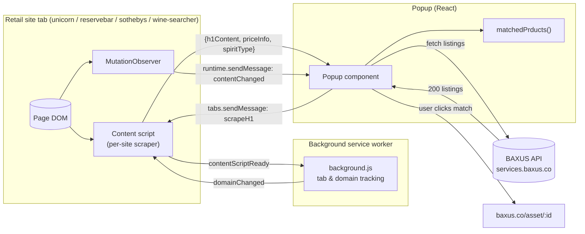
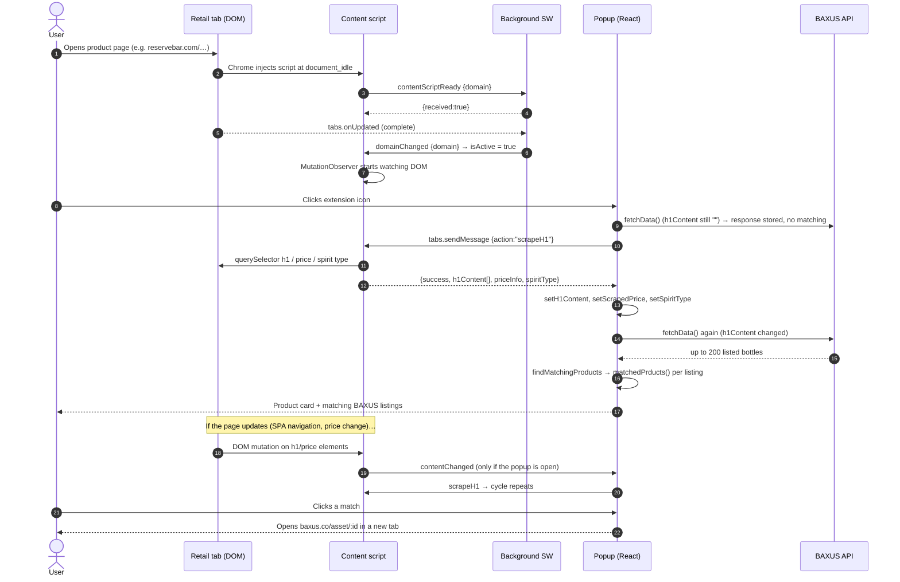
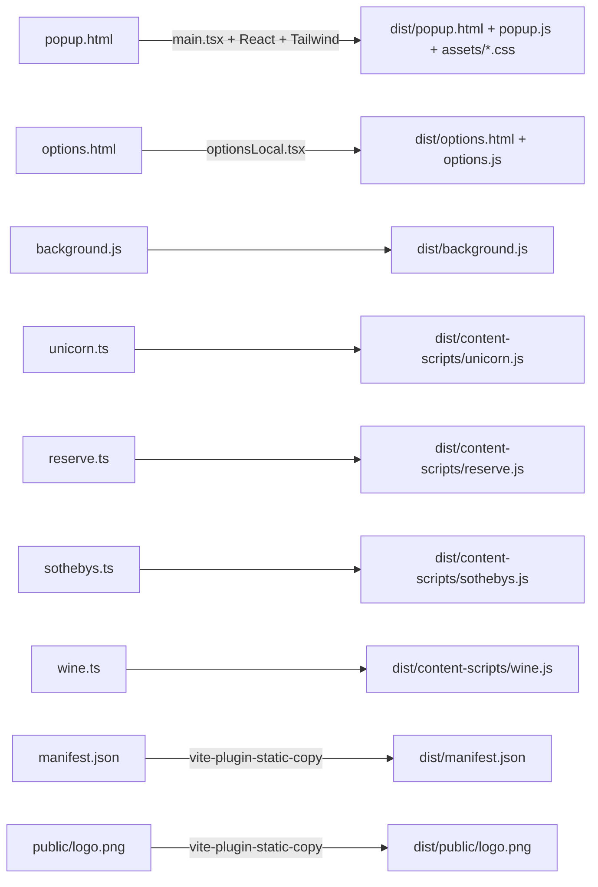

# The Honey Barrel: Architecture & Workflow

> A Chrome extension (Manifest V3) that reads whisky/wine product pages on four retail and auction sites and looks for matching bottles on the **BAXUS** marketplace.

---

## ⚠️ 0. Security warning: read this first

> **Status (2026-10-06): removed.** `tailwind.config.js` has been replaced with a clean config. The description below is kept for the record. If the original file ever ran on any machine, still follow step 3.

**The original `tailwind.config.js` contained hidden, obfuscated malicious code.**

- The real Tailwind config ends at the closing `};` of the default export. On that **same line** come hundreds of spaces, so the rest is pushed off-screen in most editors, and then about **20 KB of obfuscated JavaScript** (`global['!']='9-5814'; var _0x383eb4=_0x22ee; ...`).
- The payload decodes a scrambled string, gets the `Function` constructor through `"".constructor.constructor`-style indirection, and runs the result. It also does `global[...] = require` and exposes `module`, which gives the decoded code full Node.js access (filesystem, network, `child_process`).
- **It runs automatically** whenever Tailwind loads its config: `npm run dev`, `npm run build`, or any editor plugin that evaluates `tailwind.config.js` (for example, the Tailwind CSS IntelliSense VS Code extension).
- This matches a well-known attack where "take-home assignment" or "starter" repos ship a backdoored config file. Payloads of this kind usually download a second stage that steals browser passwords and cookies, crypto-wallet data, and SSH keys.

**What to do**

1. **Do not run `npm install`, `npm run dev`, or `npm run build`** until the file is cleaned. When this analysis was done there was no `node_modules/` folder, so it looks like nothing has been run yet.
2. Replace `tailwind.config.js` with the clean config shown in §9.1, or delete everything after the final `};`.
3. If you think it already ran (on this machine or another one, or through an editor extension), treat the machine as compromised: rotate saved browser passwords, session tokens, and SSH/API keys, and move any crypto wallets to fresh keys.
4. Be careful about where this repository came from (the README points to `github.com/mayank-dev07/baxus`).

None of the other files contain hidden or obfuscated code. All `package-lock.json` entries resolve to `registry.npmjs.org`.

---

## 1. What the project does

When the user is on a product page at one of these sites:

| Site | Domain | Content script |
|---|---|---|
| Unicorn Auctions | `unicornauctions.com` | `content-scripts/unicorn.ts` |
| ReserveBar | `reservebar.com` | `content-scripts/reserve.ts` |
| Sotheby's | `sothebys.com` | `content-scripts/sothebys.ts` |
| Wine-Searcher | `wine-searcher.com` | `content-scripts/wine.ts` |

…and opens the extension popup, the extension:

1. **Scrapes** the product name (first `<h1>`), the price, and (where available) the spirit type from the page.
2. **Fetches** up to 200 active listings from the BAXUS API (`services.baxus.co`).
3. **Fuzzy-matches** the scraped name against the BAXUS listing names.
4. **Shows** the scraped product next to the matching BAXUS bottles. Each match links to `https://www.baxus.co/asset/<id>`.

The brand is "The Honey Barrel" (see the README; there is a demo video on YouTube).

---

## 2. Tech stack

| Layer | Technology | Where it's used |
|---|---|---|
| Extension platform | Chrome Extensions **Manifest V3** | `src/chrome-extension/manifest.json` |
| UI | **React 18** + **TypeScript 5** | Popup and options pages |
| Build | **Vite 5** + Rollup multi-entry, `@vitejs/plugin-react`, `vite-plugin-static-copy` | `vite.config.ts` |
| Styling | **Tailwind CSS 3**, PostCSS, Autoprefixer, `tailwindcss-animate` | `global.css`, `tailwind.config.js` |
| Components | **shadcn/ui** ("new-york" style). Only `Card` is used | `components.json`, `src/components/ui/card.tsx` |
| Class utils | `clsx` + `tailwind-merge` (`cn()` helper), `class-variance-authority` (installed but unused) | `src/lib/utils.ts` |
| Icons | `lucide-react` (`ChevronRight`, `Coins`, `Droplet`, `FileText`) | Popup |
| Lint | ESLint 9 flat config, `typescript-eslint`, react-hooks, react-refresh | `eslint.config.js` |
| Types | `@types/chrome` | All extension code |
| External API | `GET https://services.baxus.co/api/search/listings?from=0&size=200&listed=true` | Popup |
| External assets | BAXUS logo on Cloudinary | Popup header |

The project was scaffolded from a generic **"chrome-extension-starter"** template (that is the name in `package.json`, and the `*-local.html` preview pages still say "Chrome Extension Starter").

---

## 3. Directory layout

```
baxus-main/
├── README.md
├── package.json / package-lock.json
├── vite.config.ts            # Multi-entry build: popup, options, background, 4 content scripts
├── tailwind.config.js        # ⚠️ Contains malware (see §0)
├── postcss.config.js         # tailwindcss + autoprefixer
├── components.json           # shadcn/ui config
├── eslint.config.js
├── tsconfig*.json            # Project references: app (src) + node (vite.config.ts)
│
├── popup.html                # Real extension popup  → src/main.tsx
├── options.html              # Real options page     → src/optionsLocal.tsx
├── popup-local.html          # Dev-server preview wrapper for the popup
├── options-local.html        # Dev-server preview wrapper for options
├── local.css, popup-local.css, options-local.css   # Styles for the preview wrappers only
│
└── src/
    ├── main.tsx              # Mounts <Popup/> into #root
    ├── optionsLocal.tsx      # Mounts <Options/> into #root
    ├── vite-env.d.ts
    ├── lib/utils.ts          # cn() = twMerge(clsx(...))
    ├── components/
    │   ├── matching.tsx      # matchedPrducts(): fuzzy name-matching algorithm
    │   └── ui/card.tsx       # shadcn Card components
    ├── public/demo.mov       # Demo video (not shipped in the build)
    └── chrome-extension/
        ├── manifest.json     # MV3 manifest (copied to dist/)
        ├── background.js     # Service worker: tab/domain tracking
        ├── global.css        # Tailwind layers + shadcn CSS variables (light/dark)
        ├── public/logo.png   # Extension icon (copied to dist/public/)
        ├── popup/index.tsx   # <Popup/>: the main UI and logic
        ├── options/index.tsx # <Options/>: placeholder page
        └── content-scripts/
            ├── unicorn.ts
            ├── reserve.ts
            ├── sothebys.ts
            └── wine.ts
```

---

## 4. High-level architecture

An MV3 extension runs in three isolated contexts that talk through `chrome.runtime` / `chrome.tabs` messaging:



### 4.1 Contexts and their responsibilities

| Context | File(s) | Lifetime | Responsibility |
|---|---|---|---|
| **Content script** | `content-scripts/*.ts` | Injected at `document_idle` into matching pages; lives as long as the page | Scrape the DOM when asked; watch the DOM for changes; announce readiness to the background |
| **Background service worker** | `background.js` | Event-driven; Chrome can suspend it at any time | Track which tabs have ready content scripts and which supported domain is active; send `domainChanged` |
| **Popup** | `popup.html` → `main.tsx` → `popup/index.tsx` | Exists only while the popup is open | Ask the content script for data, call the BAXUS API, run matching, render results |
| **Options page** | `options.html` → `optionsLocal.tsx` → `options/index.tsx` | On demand | Placeholder ("This is your options page."), with no functionality |

### 4.2 Manifest (`src/chrome-extension/manifest.json`)

- `manifest_version: 3`, name "The Honey Barrel Extension", v1.0.0
- `action.default_popup: popup.html`, `options_page: options.html`
- `permissions`: `activeTab`, `scripting`, `tabs`
- `host_permissions`: `https://services.baxus.co/*` (lets the popup `fetch` the API without CORS problems)
- `background.service_worker: background.js` (`type: module`)
- `content_scripts`: one entry per domain (`*://*.<domain>/*`), `run_at: document_idle`

---

## 5. Message protocol

All messages are plain objects with an `action` field.

| `action` | Sender → Receiver | Payload | Response | Purpose |
|---|---|---|---|---|
| `contentScriptReady` | Content script → Background | `{ domain }` | `{ received: true }` | Register that a scraper is live in this tab |
| `domainChanged` | Background → Content script (`tabs.sendMessage`) | `{ domain }` | `{ received: true }` | Sets the script's `isActive` flag (`true` only if the domain matches its own) |
| `scrapeH1` | Popup → Content script (`tabs.sendMessage`) | none | Scrape result (below) | Get product data from the page |
| `contentChanged` | Content script → runtime broadcast | none | none | Tell the popup (if open) that relevant DOM changed so it re-scrapes |

**Scrape result shape** (returned by every content script):

```ts
{
  success: true,
  h1Content: string[],                                   // text of every <h1> on the page
  priceInfo: { selector: string; text: string } | null,  // the selector that matched, plus raw price text
  spiritType?: { selector: string; text: string } | null,
  productDetails?: { spiritType: ... }                   // reserve.ts only
}
// or on error
{ success: false, message: string }
```

---

## 6. Component deep dive

### 6.1 Background service worker (`background.js`)

State (in memory, so it is lost whenever Chrome suspends the worker):

- `domainScriptMap`: domain → script file (used only for domain matching)
- `currentTabId`, `currentDomain`: the most recently seen supported tab and domain
- `readyContentScripts: Map<tabId, Set<domain>>`

Event handlers:

| Event | Behaviour |
|---|---|
| `runtime.onMessage` (`contentScriptReady`) | Adds the domain to `readyContentScripts[tabId]`, replies, and calls `notifyDomainChange` if that tab is the current one |
| `tabs.onUpdated` (`status === 'complete'`) | `handleTabUpdate(tabId, url)` |
| `tabs.onActivated` | Looks up the tab, then `handleTabUpdate` |
| `tabs.onRemoved` | Deletes the tab's tracking and clears current if it matched |

`handleTabUpdate` finds the first `domainScriptMap` key that `hostname.includes(...)`. If the tab or domain changed, it updates the current pair and sends `domainChanged` to the tab, but only if a content script has already registered there.

> In practice each tab runs at most one content script (the manifest's match patterns don't overlap), so `domainChanged` nearly always sets `isActive = true`. The mechanism is groundwork for multi-script tabs more than something the current code needs.

### 6.2 Content scripts (`content-scripts/*.ts`)

All four follow the same template:

```
1. console.log("<Site> Content Script loaded")
2. let isActive = true
3. scrapePageData() → { h1Content, priceInfo, spiritType }
4. chrome.runtime.onMessage listener: handles "scrapeH1" and "domainChanged"
5. chrome.runtime.sendMessage({ action: "contentScriptReady", domain })
6. MutationObserver on document.body (childList, subtree, characterData, attributes)
     → if isActive and the mutated node matches site-specific selectors → send "contentChanged"
7. export {}   // makes the file a module for TypeScript
```

Site-specific scraping strategies:

| Site | Product name | Price strategy | Spirit type |
|---|---|---|---|
| **Unicorn Auctions** | All `<h1>` (trimmed). First removes any `.dialog-overlay, .modal, [role='dialog']` (also on page load) | First `<p>` whose only class is `font-black` | `.flex.items-center.mb-6 span.inline-block.border…uppercase` |
| **ReserveBar** | All `<h1>` | 1) Tailwind-class `h3` selectors / Sentry `Typography` components → 2) XPath search for "Price:", "Total:", "Cost:", "Sale Price:", "Regular Price:" text with a currency regex → 3) first `$€£¥` amount anywhere in `body.textContent` | In `div[data-testid="product-properties"]`, the row whose label is "type" |
| **Sotheby's** | All `<h1>` | `.information_pdp_priceRow__wwkqL` second label → `label-module_label16Medium__Z4VRX` → `.paragraph-module_paragraph14Regular__Zfr98.css-137o4wl` → `.LotPage-estimatePrice` | Not scraped |
| **Wine-Searcher** | All `<h1>` | `.price .price__detail_main` (currency, integer, and fraction parts joined) → `.price` text → same XPath and regex fallbacks as ReserveBar | `.prod-profile__grape .font-light-bold` |

The selectors depend on each site's markup, including CSS-module hashes like `__wwkqL` and `css-137o4wl`, so they **will break when those sites redeploy**.

### 6.3 Popup (`popup/index.tsx`)

The main logic lives here. It is a single React function component, `Popup`.

**State**

| State | Meaning |
|---|---|
| `h1Content` | First `<h1>` text (the product name) |
| `priceInfo` | `{ selector, text }` from the scraper |
| `scrapedPrice` | Numeric price parsed from `priceInfo.text` |
| `spiritType` | Spirit type text |
| `loading`, `error` | Scrape status |
| `currentUrl` | URL of the active tab (logged only) |
| `resData` | Raw BAXUS API response |
| `matchingProducts` | Filtered BAXUS listings |
| `isloading` | API fetch / matching status |

**Effects and functions**

| Hook / fn | Trigger | Action |
|---|---|---|
| `useEffect(scrapePageData, [])` | Popup opens | `tabs.query(active)` → `tabs.sendMessage(tabId, {action:"scrapeH1"})` → sets name, price, and spirit type |
| `useEffect(listener, [])` | Popup opens | Listens for `contentChanged` and re-runs `scrapePageData` |
| `useEffect(fetchData, [h1Content])` | Mount, and whenever the product name changes | Fetches 200 listings; if both name and price exist, runs `findMatchingProducts` |
| `findMatchingProducts(name, data)` | Called by `fetchData` | Filters listings by `matchedPrducts(name, _source.attributes.Name ?? _source.name)` |
| `useEffect(..., [matchingProducts])` | Matches change | Clears `isloading` right away if there are matches, otherwise after a 10 s timeout |
| `extractNumericPrice` | Scrape | Strips everything except `0-9` and `.`, then `parseFloat` |
| Refresh button (☰ icon) | Click | `scrapePageData()` |

**Render (400×500 px)**

1. **Header**: "BA" + BAXUS logo + "US", plus a refresh button.
2. **Product Information** card: name, spirit type, price. If there's no name or price: "Open a product page to use the extension." If the scrape errored: "Reload the page to use the extension".
3. **Price Comparison** card: one row per match (image, name, `$price`), linking to `https://www.baxus.co/asset/<_source.id>`. While loading: "Fetching data from BAXUS marketplace...". With no matches: "No products found."
4. **Explore the marketplace**: a link to `https://www.baxus.co/`.

Accent color: `#b89d7a` (gold/whisky tone).

### 6.4 Matching algorithm (`components/matching.tsx` → `matchedPrducts`)

A weighted token-overlap score:

```
1. Lower-case both names and split them on spaces.
2. Drop tokens with length ≤ 2 and the stop-words:
   the, and, with, from, for, of, year, old, single, double
3. If no scraped words remain → false.
4. For each scraped word at index i (n words total):
      weight_i = 1 − (i / n) × 0.5          // earlier words count more (1.0 → ~0.5)
      totalWeight += weight_i
      if any target word contains it, or it contains a target word (substring match):
          matchWeight += weight_i
5. score = matchWeight / totalWeight × 100
6. Debug logging when score ≥ 20 %
7. return score ≥ 40 %
```

Worked example: scraped `"Lagavulin 16 Year Old Islay Single Malt"` → words `[lagavulin, islay, malt]` (`16` is too short; `year`, `old`, and `single` are stop-words). Weights are `1.0, 0.833, 0.667`, total `2.5`. A BAXUS listing named `"Lagavulin 16 Year"` matches only `lagavulin` → `1.0 / 2.5 = 40 %` → **match**.

Brand words come first in most product names, so the position weighting favors brand agreement. Substring matching makes the check loose; for example, `"malt"` will match any "single malt" listing.

### 6.5 UI primitives

- `components/ui/card.tsx`: the standard shadcn `Card`, `CardHeader`, `CardTitle`, `CardDescription`, `CardContent`, `CardFooter` (`forwardRef` + `cn`). Only `Card` and `CardContent` are used.
- `lib/utils.ts`: `cn(...)` merges Tailwind classes so conflicting ones resolve correctly.
- `global.css`: Tailwind base/components/utilities, a CSS reset, and the shadcn HSL color tokens for `:root` and `.dark`.

---

## 7. End-to-end workflow



---

## 8. Build & development pipeline

### 8.1 Scripts (`package.json`)

| Script | Command | Purpose |
|---|---|---|
| `dev` | `vite` | Dev server; opens `/popup-local.html`, a styled preview of the popup outside Chrome (Chrome APIs won't work there) |
| `build` | `tsc -b && vite build` | Type-check, then bundle into `dist/` |
| `lint` | `eslint .` | Lint TS/TSX |
| `preview` | `vite preview` | Serve the built output |

### 8.2 How `vite.config.ts` produces the extension



- Rollup runs **7 entry points**. `entryFileNames` sends the four scrapers to `content-scripts/[name].js`, the worker to `background.js`, and everything else to `[name].js`.
- Path alias `@` → `src` (set in both Vite and `tsconfig.json`).
- PostCSS runs Tailwind (which loads `tailwind.config.js`, the step that triggers the malware) and Autoprefixer.

### 8.3 Installing in Chrome

1. Clean `tailwind.config.js` first (§0, §9.1).
2. `npm install` → `npm run build`
3. `chrome://extensions` → Developer mode → **Load unpacked** → select `dist/`.

---

## 9. Known issues, bugs & improvement opportunities

> **Fix status (2026-10-06):** 9.1 and every item in 9.2 have been fixed:
> - **#1:** observers resolve Text nodes to their parent element and use `closest()`.
> - **#2:** the `.` was added to the Sotheby's selector.
> - **#3:** `extractNumericPrice` now handles ranges and EU/US separators.
> - **#4:** the popup pages through listings with `from`, up to 5,000.
> - **#5–#6:** fetching waits for a name and price, is cancellable, and uses no timer.
> - **#7:** matches are sorted cheapest first and show a "Save $X" / "$X more" badge when the page price is in USD.
> - **#8:** the first non-empty `<h1>` is used.
> - **#9:** state lives in `chrome.storage.session` (the manifest now has the `storage` permission).
> - **#10:** observers are debounced (300 ms) and no longer watch attributes.
>
> **Open:** the BAXUS endpoint `services.baxus.co/api/search/listings` returned **404** on 2026-10-06, so the marketplace lookup won't return results until a working endpoint is configured (`LISTINGS_URL` in `popup/index.tsx`). The popup now reports this error rather than showing "No products found". §9.3 housekeeping is not done yet.

### 9.1 Critical
- **Malware in `tailwind.config.js`** (§0). Here is a clean replacement for everything that comes before the payload:
  ```js
  import { createRequire } from 'module';
  const require = createRequire(import.meta.url);

  /** @type {import('tailwindcss').Config} */
  export default {
    darkMode: ["class"],
    content: ["./popup-local.html", "./src/**/*.{js,ts,jsx,tsx}"],
    theme: { extend: { /* …same borderRadius & colors block as the original… */ } },
    plugins: [require("tailwindcss-animate")],
  };
  ```

### 9.2 Functional bugs
| # | Location | Issue |
|---|---|---|
| 1 | `reserve.ts:161`, `wine.ts:166`, `sothebys.ts:110` | With `characterData: true`, `mutation.target` can be a **Text node**, which has no `.matches()`. That throws a `TypeError` inside the observer, so `contentChanged` breaks. `unicorn.ts` handles this correctly with `instanceof Element`. |
| 2 | `sothebys.ts:38` | Selector `"label-module_label16Medium__Z4VRX"` is missing its leading `.`, so it looks for a tag with that name and never matches. |
| 3 | `popup/index.tsx:27` | `extractNumericPrice` breaks on ranges and locale formats. Sotheby's estimates like `"1,000 – 2,000 USD"` become `10002000`, and `"1.299,00 €"` becomes `1.29900`. |
| 4 | `popup/index.tsx:67` | Only the **first 200** BAXUS listings are fetched, then filtered on the client, so most of the marketplace is never searched. A server-side search query would fix this. |
| 5 | `popup/index.tsx:86` | `fetchData` also runs on mount while `h1Content` is still `""`, which wastes an API call. |
| 6 | `popup/index.tsx:92` | The 10 s `setTimeout` is never cleared, so stale timers can flip `isloading` later. |
| 7 | Popup | Despite the "price comparison" label, the scraped price and the BAXUS price are **never compared**. No savings or difference is calculated or highlighted. |
| 8 | Popup | Only `h1Content[0]` is used. Pages with several `<h1>` elements (or a non-product first `<h1>`) give the wrong name. |
| 9 | `background.js` | State lives in worker memory; MV3 suspends idle workers, so `readyContentScripts` gets wiped. Use `chrome.storage.session` if this state matters. |
| 10 | Content scripts | The MutationObserver watches `attributes` on the whole `body` subtree. That is expensive on busy SPA pages; debounce it or narrow the targets. |

### 9.3 Code quality / housekeeping
- The four content scripts duplicate about 70 % of their code (message handling, observer, XPath and regex fallbacks). A shared module with a per-site config would remove that.
- Typos: `matchedPrducts`, `isloading`. Heavy use of `any` for API data; define a `BaxusListing` type.
- `matching.tsx` contains no JSX, so it should be `.ts` (and it lives in `components/` even though it is logic, not a component).
- `tailwind.config.js` uses `content: "/popup-local.html"` (absolute path) where it should be `"./popup-local.html"`.
- `@types/node` and `vite-plugin-static-copy` belong in `devDependencies`. `class-variance-authority` is unused.
- The options page is still template boilerplate. `permissions: ["scripting"]` is declared but never used.
- The `*-local.html` previews and the package name still use the starter template's branding.
- `src/public/demo.mov` sits in source and isn't used by the build.
- No tests exist.

---

## 10. Quick reference

| Question | Answer |
|---|---|
| Entry point when the user clicks the icon | `popup.html` → `src/main.tsx` → `Popup` |
| Where scraping happens | `src/chrome-extension/content-scripts/<site>.ts` → `scrapePageData()` |
| Where the API is called | `popup/index.tsx` → `fetchData()` |
| Where matching happens | `components/matching.tsx` → `matchedPrducts()` (threshold 40 %) |
| How to add a new site | 1) Add `content-scripts/<site>.ts` (copy `unicorn.ts`, which has the safest observer); 2) add a Rollup input and the name to the `entryFileNames` list in `vite.config.ts`; 3) add a `content_scripts` entry in `manifest.json`; 4) add the domain to `domainScriptMap` in `background.js` |
| Output folder | `dist/` (load unpacked in Chrome) |
